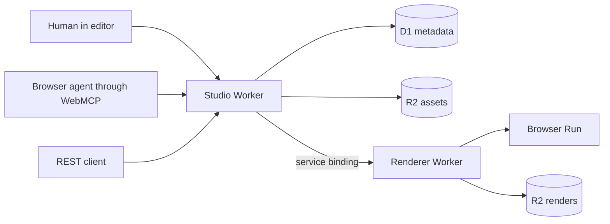

# Architecture

## Decisions at a glance

- Bun workspaces, no Turborepo
- TanStack Start for the editor and public API
- Cloudflare Workers as the deployed runtime
- separate private renderer Worker using Browser Run and Playwright
- D1 for metadata and job state
- R2 for source assets and rendered files
- shadcn/ui with Radix Nova, Geist Sans, Geist Mono, Lucide, and Tailwind 4
- pure TypeScript canonical document model
- Fabric as a canvas interaction adapter, never the stored format
- route-aware WebMCP adapter over the same application services used by the UI

## Runtime map

`apps/studio` owns web routes, internal server functions, WebMCP registration, public API handlers, persistence services, publishing, and review workflows. `apps/renderer` has no public route. The Studio Worker calls it through a service binding.

## Package boundaries

### `packages/document`

Owns schemas, types, commands, reducer behavior, revisions, field application, validation, change sets, and immutable template versions. It has no React, Fabric, database, or Cloudflare dependency.

### `packages/editor`

Defines editor state and the canvas adapter boundary. The Fabric implementation converts user gestures into document commands and projects canonical nodes into Fabric objects. Fabric JSON never crosses the persistence boundary.

### `packages/render-view`

Renders a canonical page as deterministic DOM. The studio uses it for the current vertical slice and non-interactive previews. The Browser Run renderer builds equivalent HTML for export.

### `packages/webmcp`

Defines route-aware tools and calls application services. It does not implement document behavior. Buttons and WebMCP handlers call the same command, review, validation, publishing, and rendering services.

### `packages/ui`

Owns app chrome components and tokens. Document designs do not inherit app chrome styling. Template colors, typography, and layout live inside the canonical document.

## Canonical document

The main records are:

- `Document`: revisioned editable source
- `OutputVariant`: proposal, portrait, or square output
- `Page`: fixed-size artboard and ordered node IDs
- `SceneNode`: text, image, or shape geometry and style
- `FieldDefinition`: typed public parameter
- `FieldBinding`: field-to-node-property link
- `DocumentCommand`: one undoable edit
- `ChangeSet`: reviewable agent proposal against a revision
- `TemplateVersion`: immutable published snapshot
- `RenderJob`: API request, state, and output metadata

Every command contains an ID, timestamp, and actor. The reducer validates the input and output documents. Commands increment the revision. Undo stores inverse commands or checkpoints outside the schema package.

## End-to-end data flow

### Human editing

1. The UI loads a document revision.
2. The editor adapter projects one page into Fabric.
3. A drag, resize, text edit, or layer action becomes a typed command.
4. The document reducer applies and validates the command.
5. Persistence stores the new revision and an autosave checkpoint.
6. Thumbnails and validation update from the new canonical document.

### Agent editing

1. `inspect_design` returns stable IDs and a compact representation of live state.
2. A proposal tool validates its expected base revision.
3. The service builds commands but does not apply them to saved state.
4. The UI renders a pending preview and lists operations.
5. Human decisions mark individual operations accepted or rejected.
6. Accepted commands run through the same reducer as manual edits.
7. The applied change set and resulting revision remain auditable.

### Publishing and rendering

1. Publishing runs blocking validation.
2. The service freezes the document, field manifest, asset references, and version number.
3. `POST /v1/studio/render` validates modifications against that version.
4. The Studio Worker records a render job in D1 and calls the Renderer Worker through a service binding.
5. The renderer applies field values to an isolated document copy.
6. Browser Run loads deterministic HTML at exact artboard dimensions.
7. The renderer writes PNG pages and assembled PDFs to R2.
8. D1 stores completion state, checksums, timing, and R2 keys.

## Storage model

D1 tables:

- `workspaces`
- `documents`
- `document_revisions`
- `change_sets`
- `change_operations`
- `templates`
- `template_versions`
- `render_jobs`
- `render_outputs`
- `demo_sessions`

R2 prefixes:

- `assets/{workspaceId}/{assetId}`
- `thumbnails/{documentId}/{revision}/{pageId}.png`
- `renders/{renderId}/{outputId}/{filename}`

The challenge starts without Durable Objects, KV, Queues, Containers, or Workflows. D1 transactions handle metadata consistency. The renderer runs synchronously for the demo. A Queue is the first scaling addition after the challenge if render duration or burst traffic requires it.

## Demo isolation

Each judge receives a synthetic demo workspace cloned from a read-only seed. Reset creates another clone rather than rewriting the seed. No login is required for the challenge path. A signed, short-lived demo-session cookie isolates changes and render history.

## Deployment order

1. Provision D1 and R2 resources.
2. Apply D1 migrations.
3. Deploy the renderer Worker.
4. Deploy the studio Worker because its service binding requires the renderer to exist.
5. Run the public smoke test and one real PNG/PDF render.

Cloudflare bindings come from generated `worker-configuration.d.ts` files. Secrets use Wrangler secret storage and never enter source or `wrangler.jsonc`.
