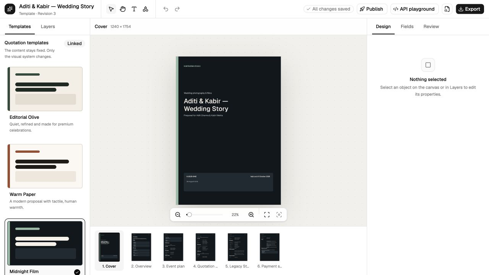
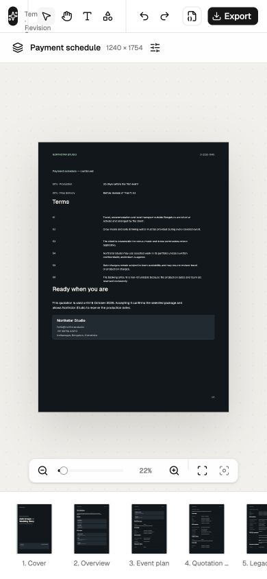
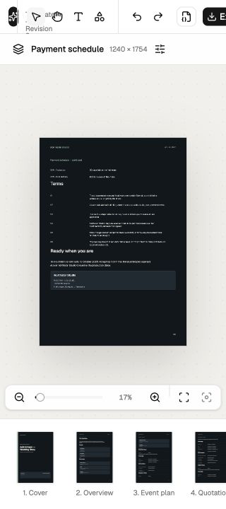
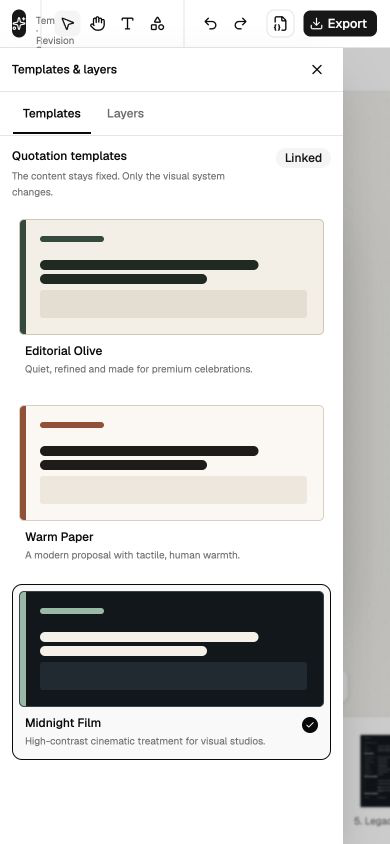
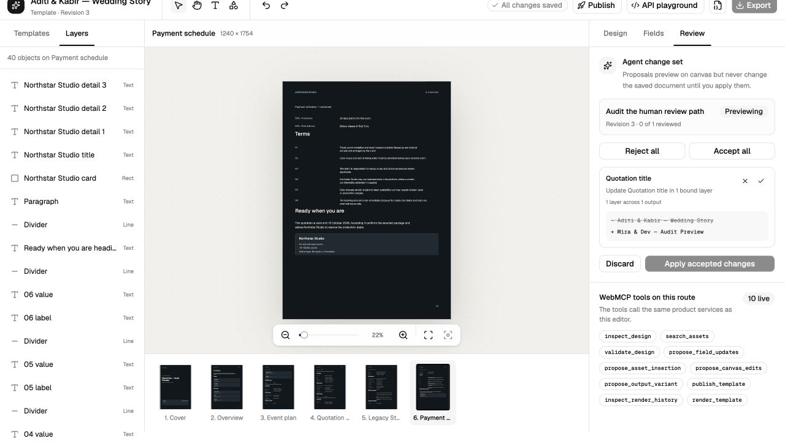

# Visual and interaction audit

## Measured shell

Measurements were taken from the running app, not a static screenshot.

| Element                  | Measured behavior                                                                             | Assessment                                                            |
| ------------------------ | --------------------------------------------------------------------------------------------- | --------------------------------------------------------------------- |
| Desktop viewport         | 1280 × 720                                                                                    | Primary audit viewport                                                |
| Top bar                  | 48 px high                                                                                    | Dense but viable; action overflow is missing                          |
| Left panel               | 236 px fixed                                                                                  | Too narrow for a scalable tree and not resizable                      |
| Right inspector          | 320 px fixed                                                                                  | Viable baseline, but not resizable/collapsible on desktop             |
| Center at 1280 px        | About 724 px                                                                                  | Canvas loses 43% of viewport width to fixed chrome                    |
| Filmstrip                | 128 px high                                                                                   | Large fixed tax for a selection-only strip                            |
| Default fit zoom         | 22%                                                                                           | Six-page proposal is legible only as a composition, not editable text |
| Top icon buttons         | Typically 28 × 28 px                                                                          | Below a robust touch/coarse-pointer target                            |
| Panel rows/controls      | Commonly 24-32 px high                                                                        | Dense enough for expert desktop use, weak for touch and accessibility |
| Small labels             | Frequently 9-10 px                                                                            | Below a comfortable editor information floor                          |
| Breakpoint discontinuity | 1120 px keeps panels and leaves about 564 px canvas; 1119 px switches to about 1119 px canvas | A one-pixel resize causes a major composition jump                    |
| Compact 320 px           | Header right edge measured around 361 px                                                      | Actions are clipped and unrecoverable                                 |

## What already works visually

- The starter quotation has a coherent art direction and reads as an intentional product, not a component gallery.
- The dark shell separates application chrome from the white output surfaces.
- Selected layers connect the canvas, flat Layers list, and inspector.
- Templates preview a meaningful style change across the full document.
- The inspector groups geometry, appearance, content, and image-specific controls into usable sections.
- Publishing, review, new-document, and asset-library dialogs maintain a consistent dark surface language.

These strengths should be preserved while the state and layout architecture is corrected.

## Major findings

### VIS-01, P0: compact actions are clipped or silently removed

**Evidence and reproduction**

1. Resize to 390 × 844. The editor fits, but document identity is nearly absent and the primary targets remain 28 × 28 px.
2. Resize to 320 × 720. The title region collapses to 0 px and the right action group extends to about x=361.42.
3. The shell uses overflow hiding, so the excess controls cannot be horizontally scrolled.
4. Publish is hidden below 900 px and API below 760 px. Neither is placed in a compact overflow menu.

**Benchmark.** Responsive parity means the composition may change while capability remains reachable. The current [Vercel Web Interface Guidelines](https://raw.githubusercontent.com/vercel-labs/web-interface-guidelines/main/command.md) also call for reachable controls, keyboard access, visible focus, and avoiding accidental overflow.

**Target.** Declare a supported compact minimum, keep a stable brand/document affordance, move secondary actions into one accessible overflow menu, and give touch/coarse-pointer modes at least 44 × 44 px hit regions even when the icon remains smaller.

**Acceptance criteria**

- No horizontal clipping at 320, 360, 390, 430, 768, 1119, 1120, 1280, or 1440 px.
- Publish, API, import, export, new document, and error status remain reachable at every supported width.
- Resize across 1119/1120 does not replace the entire information architecture in one pixel without a deliberate compact transition.
- Automated screenshots and keyboard tests cover all supported widths.

**Likely owners:** `apps/studio/src/features/studio-shell.tsx`, responsive UI primitives in `packages/ui/**`.

### A11Y-01, P0: compact drawers are visual overlays without modal behavior

**Evidence and reproduction**

- Open the compact Templates/Layers drawer.
- The DOM exposes no dialog role and no `aria-modal`.
- Focus remains on the background opener rather than entering the drawer.
- Background controls remain focusable.
- Escape does not close the drawer.
- Two close buttons are exposed without a coherent focus order.

**Benchmark.** A modal drawer needs a name, dialog semantics, focus entry, focus containment, Escape close, background inertness, and focus restoration.

**Target.** Use one tested Dialog/Sheet primitive for all compact panels. Do not hand-build overlay semantics in each feature.

**Acceptance criteria**

- Opening moves focus to a named heading or first meaningful control.
- Tab and Shift+Tab remain within the drawer.
- Escape and the close control close it.
- Closing restores focus to the opener.
- Background is inert while open.
- Axe and keyboard interaction tests pass.

**Likely owners:** `studio-shell.tsx`, shared dialog/sheet primitives in `packages/ui/**`.

### VIS-02, P1: fixed shell dimensions spend space without matching capability

**Evidence.** The 236 px left panel contains only Templates or a flat layer list. The 128 px filmstrip only selects pages. The 320 px inspector is useful but fixed. At 1280 px, the center receives about 724 px. At 1120 px, fixed panels leave about 564 px for the canvas.

**Benchmark.** The local OpenPencil reference persists resizable splitter panels with min/max constraints in `open-pencil/src/components/editor/EditorWorkspace.vue:20-89` and uses a distinct compact composition. Figma lets users collapse panels and gives the canvas predictable ownership.

**Target.** Resizable and collapsible persisted panels; filmstrip height that reflects its functionality; explicit canvas minimum; independent compact composition.

**Acceptance criteria**

- Left and right panels have documented min/default/max widths and keyboard-accessible resize handles.
- Collapse and restored widths persist per user.
- Canvas never falls below its supported minimum without entering compact mode.
- The filmstrip either gains page actions or shrinks to a navigation strip.

**Likely owners:** `studio-shell.tsx`, `quotation-sidebar.tsx`, `page-filmstrip.tsx`, layout primitives in `packages/ui/**`.

### VIS-03, P1: type and spacing are too small and lack a semantic rhythm

**Evidence.** The interface repeatedly uses 9-10 px labels, 24-32 px controls, 28 px icon buttons, and local arbitrary gaps. Panel header is about 44 px while the application bar is 48 px. Selected, hovered, disabled, and active-tool states do not share a consistent visual grammar.

**Architectural cause.** Metrics are encoded as feature-local Tailwind values instead of semantic editor recipes. A CSS pass would make the inconsistency harder to maintain, not solve it.

**Benchmark.** OpenPencil decomposes control anatomy in `open-pencil/src/theme/control.ts`, `icon-button.ts`, `toolbar.ts`, `canvas-pane-header.ts`, and `page-list.ts`. That creates a reusable state contract rather than independent local styling.

**Target metrics**

- Body/field text: 12-13 px minimum for dense desktop chrome.
- Secondary metadata: 11-12 px minimum with sufficient contrast.
- Standard compact control: 32 px visible height; 36 px for text fields where typing accuracy matters.
- Pointer target: minimum 32 × 32 px for precise desktop pointers and 44 × 44 px for coarse-pointer layouts.
- Spacing rhythm: 4 px base with named 4/8/12/16/24 tokens.
- Focus ring: 2 px visible ring with non-color cue where state can be confused.

**Acceptance criteria**

- No product text below the declared metadata minimum except nonessential canvas annotation.
- Every interactive state has default, hover, pressed, focus-visible, selected/checked, disabled, and loading definitions.
- Component-level visual tests cover light artwork on dark shell and dark artwork on light output.

**Likely owners:** `packages/ui/**`, global styles, all editor feature components.

### INT-01, P0: Select and `V` destroy selection

**Evidence and reproduction.** Select a layer, then press `V`. The inspector changes to Nothing selected and Zoom to selection becomes disabled. The shell listener activates Select in `studio-shell.tsx:290-362`; the editor hook independently handles `V` by clearing selection in `use-document-editor.ts:1468-1579`. The visible Select button also clears selection.

**Benchmark.** In Figma-style editors, activating the selection tool changes the tool, not the selected objects.

**Target.** One command registry and one shortcut dispatcher. `tool.select` must only change tool state; `selection.clear` must be a separate Escape/background command.

**Acceptance criteria**

- Toolbar Select, `V`, menu command, and WebMCP adapter invoke the same command.
- Existing selection remains selected.
- A duplicate-binding test fails if two listeners own the same key in the same scope.
- Platform-specific labels show Cmd on macOS and Ctrl on Windows/Linux.

**Likely owners:** `studio-shell.tsx`, `use-document-editor.ts`, new command layer in `packages/editor/src/**`.

### INT-02, P0: pending review advertises mutations that cannot safely run

**Evidence and reproduction.** Create a WebMCP proposal, leave it pending, and click Add text. The button remains enabled. The revision and node count do not change, but selection becomes a newly generated text-node ID that is absent from the document. Undo and redo also remain enabled. The commit guard rejects the document mutation, but caller-side selection effects still run.

**Architectural cause.** Review lock is enforced deep in `commit` rather than expressed as a derived command capability. UI, keyboard, history, selection side effects, and WebMCP can therefore disagree.

**Target.** A shared `review-preview` mode disables every mutating command before invocation. Navigation, inspection, review decisions, and focus-to-affected-node remain enabled.

**Acceptance criteria**

- All toolbar, inspector, field, page, layer, template, keyboard, history, and WebMCP mutations derive `canExecute=false` while pending.
- Blocked actions do not create selection, transient renderer, history, or error side effects.
- The mode is visibly named and announced.
- An exhaustive browser test enumerates every mutation control.

**Likely owners:** `use-document-editor.ts`, `studio-shell.tsx`, `inspector-sidebar.tsx`, command/capability layer.

### INT-03, P1: history and continuous controls do not model interaction transactions

**Evidence.** `packages/editor/src/history.ts` stores full-document snapshots. Undo/redo replace documents and clear selection. Each nudge can create a step; color `onChange` can commit continuously. Fabric gestures lack a formal begin/preview/commit/cancel lifecycle.

**Benchmark.** OpenPencil separates input/gesture/selection/render-loop responsibilities under `packages/vue/src/canvas/**`, `shared/input/**`, and `editor/selection-state/**` and tests engine behavior as transactions.

**Target.** Named document transactions with preview state outside the canonical document, one commit per completed gesture, cancel support, coalescing, and selection reconciliation.

**Acceptance criteria**

- One drag, resize, rotate, slider drag, or color drag creates one undo entry.
- Escape cancels a live transform and restores geometry.
- Undo preserves selection when the node still exists.
- Consecutive nudges coalesce within a documented interval.
- Large-image history stays within an explicit memory budget.

**Likely owners:** `packages/editor/src/history.ts`, `fabric-adapter.ts`, `fabric-artboard.tsx`, `use-document-editor.ts`.

### INT-04, P1: viewport ownership is global and selection feedback is approximate

**Evidence.** Pan/zoom and Hand drag worked. Modifier-wheel handling is registered broadly enough to suppress browser zoom outside the canvas. The selection outline is a DOM approximation over Fabric rather than renderer-derived geometry.

**Target.** The focused or hovered viewport owns editor gestures; all other surfaces retain browser behavior. Selection geometry comes from one renderer/canonical transform source.

**Acceptance criteria**

- Cmd/Ctrl+wheel over panels preserves browser zoom/scroll behavior as designed.
- Canvas gesture ownership is explicit and tested for mouse, trackpad, touch, and nested dialogs.
- Rotated/scaled/grouped selections have pixel-aligned outlines at every zoom.

**Likely owners:** `use-canvas-gesture-navigation.ts`, `fabric-artboard.tsx`, viewport utilities in `packages/editor/src/viewport.ts`.

### A11Y-02, P1: canvas and async status lack an accessible operating model

**Evidence.** The canvas is exposed as an application-like surface without a focusable semantic object model. Six full page previews add all page text to the accessibility tree. Async Preparing, Exporting, and job status changes do not consistently use live regions. Three hidden file inputs appear as duplicate Choose File controls.

**Target.** Provide a keyboard-operable layer tree and property route as the accessible alternative to direct canvas manipulation; make canvas focus and shortcut scope explicit; announce meaningful async state; remove duplicate hidden controls from the accessibility tree.

**Acceptance criteria**

- A keyboard-only user can select, move, resize numerically, lock, hide, order, duplicate, and delete objects.
- Focus location and shortcut scope are visible.
- Loading, success, and failure transitions use appropriate status/alert regions without chatter.
- Decorative/offscreen thumbnail content is hidden or summarized.

**Likely owners:** canvas component, layer tree, shell, dialogs, file-input abstractions.

## Visual target, not a reskin

The recommended visual correction is structural:

1. Define semantic recipes for editor toolbar, icon button, panel header, tree row, field, segmented control, status badge, canvas HUD, and compact sheet.
2. Derive selected/checked/disabled/loading states from command capabilities.
3. Make panel dimensions resizable and persisted.
4. Replace toolbar hiding with an accessible overflow system.
5. Add rendered visual fixtures before tuning individual spacing values.

This sequence prevents a round of cosmetic CSS from masking command and layout defects.
