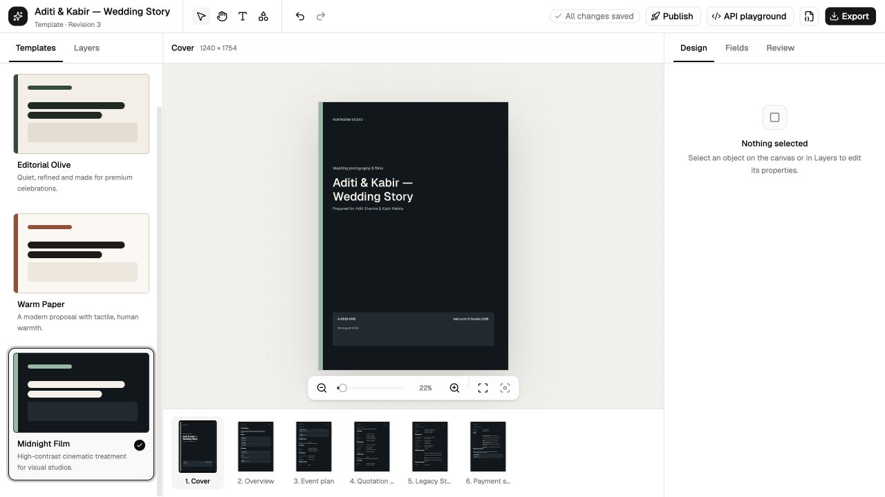
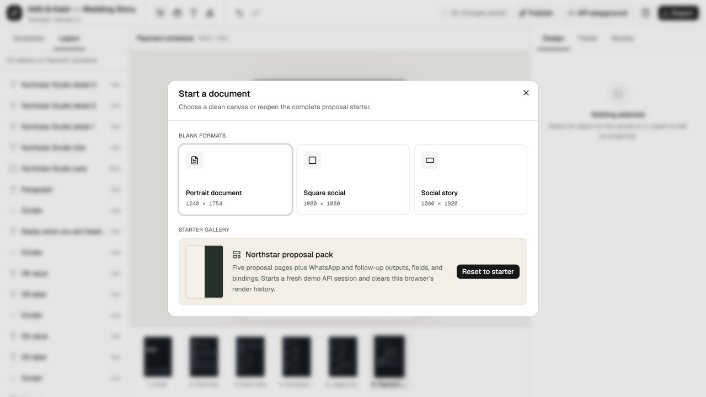
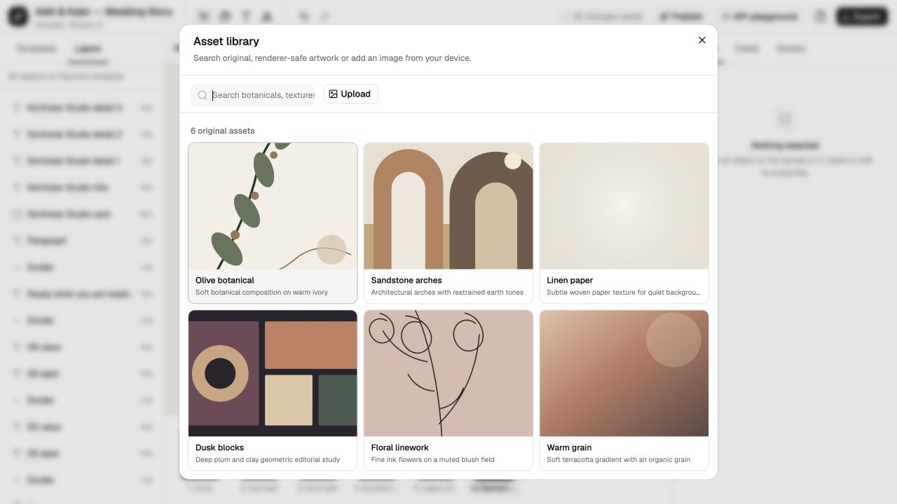
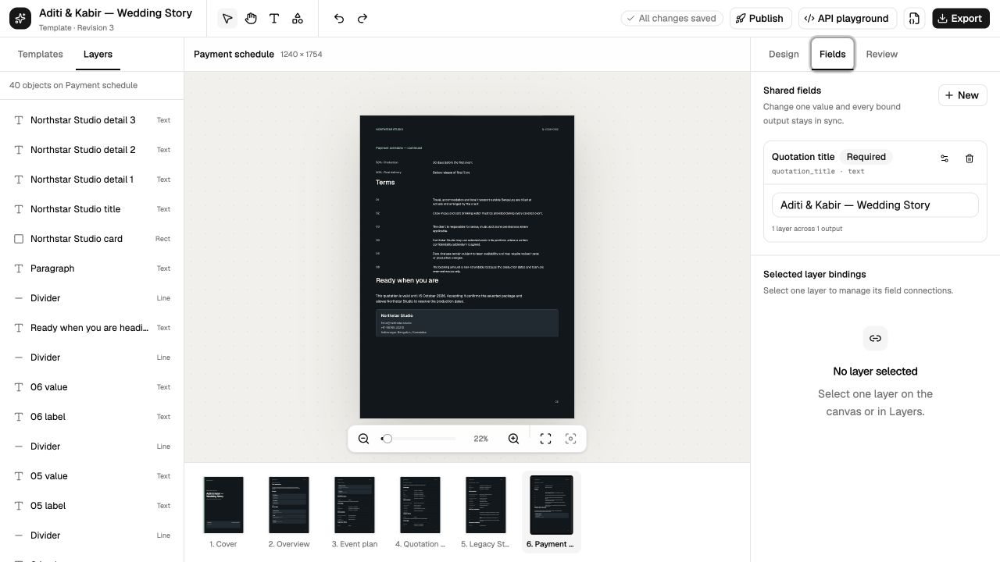
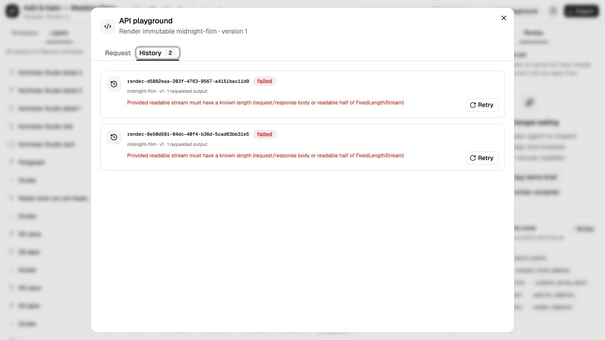

# Workflow and feature audit

## Product model observed

The live product is currently two products sharing one shell:

1. A specialized quotation composer that owns the starter content, three themes, six fixed pages, fields, review, publishing, and API demo.
2. A partially exposed general document editor with shapes, text, image insertion, inspector controls, page/output commands, JSON import/export, and raster/PDF export.

The quotation path is the only path with a convincing first result. The general editor path has no start surface, no reachable page growth, no reusable user media, and no template catalog. The production task is to reconcile these models, not add more isolated feature buttons.

## End-to-end results

| Flow                                           | Result                                                                                          | Classification                                              |
| ---------------------------------------------- | ----------------------------------------------------------------------------------------------- | ----------------------------------------------------------- |
| Open starter and inspect six pages             | All pages opened; starter rendered consistently                                                 | Working                                                     |
| Select from Layers and inspect                 | Canvas, layer row, Design and Fields updated                                                    | Working                                                     |
| Add text, edit content, undo/redo              | Mutation and round trip worked; undo cleared selection                                          | Partial                                                     |
| Add rectangle, ellipse, line, heart            | Each inserted and was undoable                                                                  | Working                                                     |
| Apply three quotation themes                   | Each recomposed the document; source revision stayed at 3                                       | Partial/misleading template semantics                       |
| Pan and zoom                                   | Wheel, Hand drag, fit, 100%, in/out, selection zoom worked                                      | Working/partial scope                                       |
| Copy, paste, duplicate, group, ungroup, delete | Exercised paths worked and were restored                                                        | Working                                                     |
| Create blank document                          | Dialog offers three presets; destructive path inspected, separate track verified blank dead-end | Partial                                                     |
| Asset library                                  | Six static assets searchable; insertion and undo worked                                         | Partial                                                     |
| Upload image                                   | Upload, inspect, cover/contain, focal, alt, replace entry point worked                          | Partial; no reusable upload library                         |
| Fields                                         | Text field/value/binding surfaces work; type depth is shallow                                   | Partial                                                     |
| WebMCP inspect and validate                    | Returned active design information and zero issues for starter                                  | Working/partial scope                                       |
| WebMCP proposal and review                     | Accept/reject/apply worked; mutation lock was unsafe                                            | Partial/broken state boundary                               |
| Publish                                        | Validation passed and version 1 published                                                       | Working/partial integrity                                   |
| API render                                     | Two PDF attempts failed with the same stream-length error                                       | Broken                                                      |
| JSON export                                    | Programmatic download path invoked; browser event did not expose a download                     | Code path present, end result not independently verified    |
| PNG export                                     | Returned to idle without a console error                                                        | Working path observed, artifact not independently inspected |
| Six-page PDF export                            | Exporting state completed after about seven seconds                                             | Working path observed, artifact not independently inspected |
| Compact drawer                                 | Opens visually; no dialog/focus/Escape behavior                                                 | Broken accessibility                                        |

## Findings

### WF-01, P0: page and output management are implemented but absent from the shipped shell

**Evidence.** The bottom `page-filmstrip.tsx` selects pages only. `use-document-editor.ts:1131-1310` exposes page and output commands. `document-sidebar.tsx:122-420,689-868` contains page/output management and a richer layer tree. `studio-shell.tsx:875-888,1103-1119` mounts `QuotationSidebar` instead. Repository search found no mounted `DocumentSidebar`.

**User impact.** A blank document cannot add page two. A user cannot duplicate a designed page, reorder a proposal, rename a page, alter page size/background, create another output, or repair a template structure from the visible product.

**Benchmark.** Canva keeps page actions near page navigation, and Figma-style editors keep hierarchy and surface management continuously reachable.

**Target.** One left-side information architecture for Templates, Pages/Outputs, and Layers. All page actions use the same command IDs in filmstrip, sidebar, menu, shortcuts, and WebMCP.

**Acceptance criteria**

- Blank documents can add, duplicate, rename, resize, reorder, and delete pages.
- Last-page and last-output deletion rules are explicit and communicated.
- Desktop and compact layouts expose equivalent capabilities.
- Every page/output hook callback is either reachable and tested or removed.
- Page thumbnails, API outputs, and renderer order share one canonical order.

**Likely owners:** `studio-shell.tsx`, `document-sidebar.tsx`, `quotation-sidebar.tsx`, `page-filmstrip.tsx`, `use-document-editor.ts`, document commands.

### WF-02, P1: templates are quotation themes, not template-led creation

**Evidence.** Templates shows three palette variants and synthetic preview bars. It is disabled without quotation source data. Choosing a theme recomposes the whole quotation rather than inserting reusable content or creating a new design.

**User impact.** The label creates Canva-like expectations that the product does not meet. Blank and imported documents cannot use templates. Existing edits are at risk when a whole-document recompose is framed as a style choice.

**Benchmark.** [Canva templates](https://www.canva.com/templates/) are searchable, categorized, previewed starters that users customize. The local Canva clone creates a project from template JSON before navigation in `canva-clone-fabric/src/app/(dashboard)/templates-section.tsx:13-99`.

**Target.** A template repository with metadata, real previews, dimensions, category/tags, source/version, and explicit semantics: Create new from template by default; Apply to current document only with a diff/confirmation and one undoable transaction.

**Acceptance criteria**

- Templates work for general documents, not only quotation-source documents.
- Search, category, loading, empty, failure, and retry states exist.
- Preview images are generated from the same renderer as the template.
- Applying to current work explains affected pages/fields/assets and is fully undoable.
- Template versions are immutable and pass aggregate validation.

**Likely owners:** quotation/template sidebar, template API routes, document composer, renderer preview pipeline.

### WF-03, P1: first run hides the product model and blank state is a dead end

**Evidence.** `use-document-editor.ts:102-180` initializes the quotation seed unconditionally. New document offers only Portrait 1240 × 1754, Square 1080 × 1080, and Story 1080 × 1920, plus Reset to starter. No recent documents, naming, custom size, units, template chooser, or walkthrough exists. A blank page has no empty-state actions, and page growth is unreachable.

**Target.** A lightweight home/start mode with recent documents, recovery state, template search, blank presets/custom size, and an optional sample. Inside a truly empty document, offer Add text, Upload image, Add page, and Choose template.

**Acceptance criteria**

- A new user can describe the document/page/output relationship after the first-run flow.
- Returning users land on recoverable recent work or can choose a clean start.
- Starter sample is opt-in or clearly identified, never silently canonical user content.
- Storage/import failures cannot silently replace work.

**Likely owners:** editor initialization, new-document dialog, document repository, routing/start screen.

### WF-04, P1: image insertion works, but media management does not

**Evidence.** Upload accepts an image, stores it in IndexedDB, inserts it, and exposes cover/contain, focal sliders, alt text, local asset ID, and Replace. `local-asset-store.ts` only saves/loads by ID. There is no list, delete, query, migration, progress, failure recovery, or reference accounting. The asset library contains six static inline SVG assets; uploaded files do not appear there.

**Benchmark.** [Canva image upload](https://www.canva.com/features/image-upload/) treats uploads as reusable project assets. The local Polotno guidance explicitly says a production upload panel needs APIs to list, upload, and delete user images.

**Target.** A versioned media repository with `list/get/upload/delete`, progress, retry, metadata, deduplication, storage quota, and reference-safe deletion. Built-in and user assets should be distinguishable but searchable in one discoverable media surface.

**Acceptance criteria**

- Uploaded images survive reload and appear in a Recent/Uploads collection.
- Upload reports progress, cancel, retry, invalid type, oversize, quota, and offline failures.
- Deletion warns about document references and never creates broken published versions.
- Asset metadata and storage records are validated/migrated.

**Likely owners:** `local-asset-store.ts`, asset library dialog/catalog, upload entry points, storage/API layer.

### WF-05, P1: text creation is a primitive, not a document-writing flow

**Evidence.** Add text inserts one hard-coded Geist 44 px placeholder. Typography can be edited later, but there are no heading/body/caption presets, inline creation choices, overflow/auto-size state, rich-text runs, list semantics, or document text styles.

**Benchmark.** [Canva text editing](https://www.canva.com/help/add-and-edit-text/) emphasizes quick text addition and styling; Figma exposes explicit text properties and layout behavior.

**Target.** Content-first text insertion with heading/body/caption presets, direct editing, clear resizing modes, overflow feedback, paragraph/list semantics, reusable styles/tokens, and keyboard flow.

**Acceptance criteria**

- Users can add a readable heading and body without correcting a 44 px default.
- Text overflow is visible before export and covered by validation.
- Editing, selection, and shortcuts do not conflict.
- Renderer/export matches editor line breaks and font metrics for fixture documents.

**Likely owners:** text commands/presets, Fabric adapter, inspector, document schema, renderer.

### WF-06, P0: review preview is functional but not a safe editor mode

**Evidence.** WebMCP proposal creation, per-operation accept/reject, apply, and revision conflict work. While pending, visible mutation controls remain enabled. Clicking Add text does not commit but can leave a ghost selection. Undo/redo remain enabled. Error feedback is confined to Review, even when the blocked action was clicked elsewhere.

**Target and acceptance.** See `INT-02` in [visual and interaction audit](./visual-and-interaction-audit.md#int-02-p0-pending-review-advertises-mutations-that-cannot-safely-run). In addition, review records need author/tool provenance, timestamp, affected pages/nodes, focus action, resolution history, reload survival, and inspectable applied/discarded state.

**Likely owners:** `inspector-sidebar.tsx`, `use-document-editor.ts`, `packages/document/src/change-sets.ts`, persistence layer.

### WF-07, P1: fields expose real binding mechanics but weak type and deletion semantics

**Evidence.** Create/edit dialogs validate label/key basics, values can be changed, and bindings connect a field to compatible properties. Currency, date, and asset use generic text inputs. Delete Field immediately removes the field value and every binding. Bound layers cannot be navigated from the field.

**Target.** Type-specific schemas and editors, binding impact summaries, focus-to-bound-node, confirmation before destructive changes, and atomic undo.

**Acceptance criteria**

- Date, currency, number, boolean, text, and asset values have typed validation and serialization.
- Delete reports `N bindings across M outputs` and requires confirmation when impact is nonzero.
- Undo restores definition, value, and bindings atomically.
- Clicking a binding opens its page and focuses the layer/property.

**Likely owners:** `inspector-sidebar.tsx`, `packages/document/src/fields.ts`, schemas and commands.

### WF-08, P0: publish succeeds but the promised API output loop is broken

**Evidence.** Readiness validation passed and version 1 published. The API playground showed one modification and one PDF output. Two attempts to run the output produced retained failed jobs with the identical stream-length message.

**User impact.** This is the product's central WebMCP/API promise. A successful editor demo that cannot generate the published artifact fails at the highest-value handoff.

**Target.** Durable render job execution with validated input, known body length/stream semantics, timeout, cancellation, retry policy, stable error code, request/job correlation, artifact integrity, and end-to-end tests.

**Acceptance criteria**

- The published starter renders PDF successfully from the API playground and HTTP client.
- Retry is idempotent or creates a clearly related attempt without duplicate side effects.
- Failed jobs show stable code, user-safe message, correlation ID, and actionable retry/cancel.
- Artifacts are inspected for MIME type, nonzero size, page count, and content fixture.
- A deployment smoke test covers publish to authenticated render to download.

**Likely owners:** `apps/renderer/src/index.ts:123-169`, `apps/studio/src/routes/v1/studio/render.ts:129-173,353-452`, job/history state, API playground.

### WF-09, P1: import/export states do not establish artifact confidence

**Evidence.** JSON import chooser opens. JSON export invokes a programmatic anchor. PNG returned to idle. Six-page PDF showed Exporting and completed after about seven seconds. The browser harness did not receive inspectable download events for these programmatic paths, so artifact contents were not independently verified. Errors are summarized in narrow badges that disappear at some breakpoints.

**Target.** Named export jobs with progress/status, downloadable result metadata, cancellation where possible, stable errors, renderer conformance, and testable artifact capture.

**Acceptance criteria**

- Browser tests capture and inspect JSON, PNG, and PDF artifacts.
- JSON round-trip preserves canonical document equality after migration/normalization.
- PNG dimensions and PDF page count/content match outputs.
- Export failures are announced and remain visible on compact layouts.
- Import validates both schema and relational invariants before replacement, with recovery of the current draft.

**Likely owners:** shell export/import handlers, export routes, document validation, renderer.

## Discoverability judgment

The app is discoverable only if the user follows the intended quotation story. Its strongest functions are distributed across icon tooltips, a quotation-only Templates tab, flat Layers, inspector tabs, and hidden compact controls. There is no menu model or command search to teach the editor. The target should combine Canva's obvious starting points with Figma's stable expert structure:

- Start: recent, template, blank, import.
- Left: Templates/Assets, Pages/Outputs, Layers.
- Center: canvas plus stable tools and viewport controls.
- Right: Design, Fields, Review.
- Global: File, Edit, View, Object, Text, Arrange, Help/shortcuts, command search.

Every placement must be backed by one command/capability layer so discoverability does not create duplicate behavior.
